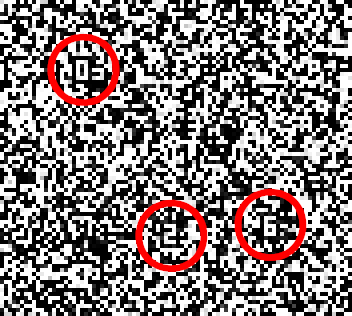

# Ugra CTF X 2024: Райтап

[Сайт компании](#сайт-компании)  
[Адрес](#адрес)  
[Резюме](#резюме)  
[Первый этап собеседования](#первый-этап-собеседования)  
[Второй этап собеседования](#второй-этап-собеседования)  
[Тестовое задание](#тестовое-задание)  
[Офис](#офис)  
[Эксперименты](#эксперименты)  
[Проект по Сбору Данных через Опросы](#проект-по-сбору-данных-через-опросы)  
[Системный администратор](#системный-администратор)  
[VPN](#vpn)  
[Подключение к VPN](#подключение-к-vpn)  
[Пароль](#пароль)  
[Самба](#самба)  
[Название компьютера](#название-компьютера)  
[Важная встреча](#важная-встреча)  
[Всё тайное становится явным](#всё-тайное-становится-явным)

## Сайт компании

В начале соревнования мы видим [видеоролик](https://youtu.be/F5Y17nikqKk) с камер видеонаблюдения. На нём Калан достаёт некое устройство, однако чуть позже замечает кого-то и убегает. Также нам предоставляют [дамп](tasks/teamteam/company/ext.zip) этого устройства.

В архиве видим довольно много файлов. В корне лежит некий `Manifest` — возможно, по нему удастся понять, что это за файлы такие. Внутри, судя по всему, перечислен список файлов архива. Давайте попробуем взять самый нетипичный и поищем его. Например, `dolphin/L3_Lab_research_128x54/frame_0.bm`.

Единственный результат поиска — [официальный репозиторий Flipper Zero `flipperzero-sd-card-examples`](https://github.com/flipperdevices/flipperzero-sd-card-examples/blob/dev/Manifest). Судя по всему, мы действительно имеем дело с картой памяти Флиппера.

Если сравнивать содержимое архива с этим репозиторием, мы заметим некоторое количество считанных тегов. Можно перебрать все, а можно заметить явно выделяющийся тег `nfc/NFC-2024_06_17-13_37.nfc`, у которого метаданные отличаются от остальных. Прочитать теги довольно просто — нужно взять все Page, сконкатенировать и декодировать HEX.

В полученном результате довольно явно читается vCard-визитка — видимо, она используется в качестве некого пропуска. Организация — `Teemoorka Network`.

Находим несколько упоминаний в интернете: оказывается, в 2018 году участники уже сталкивались с работой данной организации в сетевом пространстве. Сайт остался там же — на [teemoorka.network](https://teemoorka.network). Это и был ответ к первому заданию.

Ответ: **teemoorka.network**

## Адрес

В тех же упоминаниях находим [старый отзыв на TripAdvisor](https://www.tripadvisor.ru/ShowUserReviews-g8524271-d8520245-r601249751-Eiffel_Tower-Parizh_Chelyabinsk_Oblast_Urals_District.html), который сообщает, что офис компании находится в Эйфелевой башне. И даже в Париже. Но не в том, о котором можно было бы подумать, а [в одноимённом селе](https://ru.wikipedia.org/wiki/%D0%9F%D0%B0%D1%80%D0%B8%D0%B6_(%D0%A7%D0%B5%D0%BB%D1%8F%D0%B1%D0%B8%D0%BD%D1%81%D0%BA%D0%B0%D1%8F_%D0%BE%D0%B1%D0%BB%D0%B0%D1%81%D1%82%D1%8C)) в Челябинской области.

Ищем адрес на картах и сдаём.

Ответ: **Париж, Советская 56**

## Резюме

После этого нам становится известно, что Калан составил для компании какое-то тестовое задание и нам предлагают его найти. Вполне логично предположить, что тестовое задание дают людям, ищущим работу в компании.

На сайте есть ровно одна кнопка «Приглашаем на работу». Однако, при её нажатии сайт падает. Есть два пути решения задания — веб-путь и OSINT-путь.

Веб-путь заключался в изучении ошибки веб-приложения. В консоли браузера видим сообщение `ReferenceError: VACANCY_ID is not defined` и сразу же узнаём, что используемый фреймворк — Next.js. Один из вариантов решения — скачать все подгруженные JS-файлы и найти в них упоминания этой переменной. Одно из упоминаний — как раз искомое:


OSINT-путь заключался в изучении всех известных досок объявлений и сайтов с предложениями о работе и поиске подходящих вакансий.

Оба пути приводят нас к вакансии на позицию [Директора ИБ](https://chelyabinsk.hh.ru/vacancy/102105865) в Париже. Изучив все обязательные требования, понимаем, что мы им соответствуем, и направляем свою анкету.

Через некоторое время после пары дополнительных вопросов мы получаем отказ.

Из отказов узнаём, что наша заявка должна удовлетворять ряду критериев:
* 6 лет опыта в сфере ИБ
* Готовность работать без зарплаты и выходных
* Готовность к переезду в Париж

Исправив резюме и направив его повторно — рекрутер указывает, что подавать его можно через час — получаем приглашение на прохождение первого этапа собеседования. Записываемся на него.

## Первый этап собеседования

Первый этап собеседования состоит из двух частей. В первой части рекрутер задаёт общие вопросы о кандидате, узнаёт его предпочтения и оценивает совместимость с компанией; а во второй — задаёт логические задачи для проверки профессиональных навыков.

[Ответы на задачи](writeups/interview.md)

По результатам собеседования нам открываются ещё два пути — второй этап собеседования и то самое тестовое задание. Проходить их можно в любом порядке.

Ответ: **test-assignment-09fc26ba23.teemoorka.network**

## Второй этап собеседования

Второй этап собеседования проводится инженером компании, который задаёт сложнейшие технические задачи о логарифмическом алгоритме поиска гамильтонова пути, упаковке рюкзака при выходе на работу, оптимизациях GCC и функциональном программировании.

В целом, инженер не так строг, как рекрутер, и даже малое количество правильных ответов позволяло пройти этот этап.

## Тестовое задание

В тестовом задании предлагается шесть задач — три на работу с объектами (дверь, замок и ключ), и три на поиск натуральных чисел.

### Дверь

Видим буквально дверь, при нажатии на которую пишут «Дверь закрыта». Потыкавшись, понимаем, что ручку двери можно повернуть, если нажать на нее мышкой и вести по дуге окружности. Чтобы дверь открылась, нужно нажать на нее, пока ручка повернута. Сделать это можно двумя способами. Во-первых, можно зайти с телефона, увеличить масштаб страницы, чтобы за ручку можно было ухватиться, и сделать нужное действие двумя пальцами. Во-вторых, можно прогнать обфусцированный JS-код страницы через obf-io.deobfuscate.io и просимулировать нужные события.

### Замок

Видим клавиатуру пианино, на которой можно набирать ноты. При нажатии любой ноты, кроме правильной, нам пишут «Не та нота :-( Попробуйте еще раз, вы точно справитесь!», а при нажатии си третьей октавы издается звук. После этого правильная нота меняется. Можно написать тупой перебор, отправив кучу HTTP-запросов, а можно подобрать первые несколько нот руками, а потом погуглить мелодию и понять, что это упрощенная версия Never Gonna Give You Up. Прослушав рикролл, получаем флаг.

### Ключ

Дан приватный ключ ed25519 для SSH, но куда с ним заходить — непонятно, да и при попытках использования ключа SSH пишет «error in libcrypto». Возможно, это вообще не ключ? Декодировав base64 ключа, убеждаемся, что внутри находится не настоящий ключ, а shell-скрипт подключающийся к определенному серверу с определенной парой логин/пароль. На сервере есть директория `/secret` с файлом с названием «Нет, вам сюда не надо», при выводе которого командой `cat` мы видим текст `Мамой клянусь, нет здесь ничего`. Хмм, звучит как намек... `ls` показывает, что файл занимает 88 байт, т.е. в UTF-8 это было бы около 44 символов русского текста, а мы видели явно более короткое сообщение. Через `xxd` понимаем, что в файле был скрыт текст «У рута пароль nyan». Ага, сейчас зайдем под рутом! Запускаем `su`, но тот выдает ошибку `/usr/bin/su: line 3: can't create /tmp/su-calls: Permission denied` и странный текст. `cat /usr/bin/su` выдает шелл-скрипт, содержащий флаг.

_Прим. Калана: при разработке следующих трёх заданий уровень уцуцуги был установлен весьма суровым, поскольку были приняты предположения, что задания, во-первых, будут чётко отмечены как «задания от Калана», а во-вторых, будут обсуждаться и решаться совместно большим коллективом. Судя по всему, первого не произошло, а второе не слишком помогло в том смысле, в котором ожидалось._

### nonce

Внимательно всматриваясь в видео (но лучше — в его отдельные кадры) в поисках каких-нибудь паттернов, рано или поздно можно заметить мелкие цифры.



Собрав образцы (для этого достаточно первого кадра), отрисуем шрифт. На видео белые цифры всегда обводятся чёрным контуром — это можно использовать при поиске их на кадре, чтобы не ловить ложные срабатывания.


См. [файл со шрифтом](writeups/fonx.png).

Для удобства дальнейшей работы из видео можно выпотрошить все кадры:

```bash
$ ffmpeg -i nonce.mov nonce-%03d.png
```

Можно продетектировать цифры, попиксельно сравнивая их со шрифтом:

```python
import PIL.Image
import tqdm

result = ""

font_im = PIL.Image.open("fonx.png")
font = [font_im.crop((5 * i, 0, 5 * (i + 1), 7)) for i in range(10)]

for i in tqdm.tqdm(range(1, 121)):
    im = PIL.Image.open(f"nonce-{i:03d}.png")
    for x in range(1280 - 5):
        for y in range(720 - 7):
            for digit in range(10):
                check_ok = True
                for dx in range(5):
                    if not check_ok:
                        break

                    for dy in range(7):
                        px = font[digit].getpixel((dx, dy))
                        im_px = im.getpixel((x + dx, y + dy))

                        if px[-1] == 0:
                            continue  # прозрачный пиксель в шрифте — не проверяем

                        if bool(px[0]) != (im_px[0] >= 128):  # проверка яркости с учётом огрех сжатия
                            check_ok = False
                            break  # найдено несовпадение, пробуем следующую цифру

                if check_ok:
                    result += str(digit)
                    break

print(result)
```

Обработку разных кадров можно производить параллельно, в том числе кооперируясь с другими участниками.

Цифры расположены на всех кадрах недалеко от горизонтальной средней линии — поэтому естественно прочитать их слева направо. Выписав подряд их все по горизонтали (в порядке увеличения горизонтальной координаты) из всех кадров от первого к последнему, получим ответ.

**Ответ: [719302…794231](writeups/nonce-answer.txt) (5048 цифр)**

### k

Требуется найти достаточно длинное (но более короткое, чем в остальных заданиях) число _k_, участвующее в некоторой рекурсии.

Любители занимательных математических изобретений, освещаемых во всяих статьях и [видео](https://youtube.com/search?query=tupper+formula), могут вспомнить формулу Таппера ([Tupper’s self-referential formula](https://en.wikipedia.org/wiki/Tupper's_self-referential_formula)). Если изобразить графически значения формулы на двухмерной дискретной (то есть пиксельной) плоскости — то появится изображение самой формулы, и это поначалу кажется удивительным, потому что ничего похожего на получаемую картинку сама формула не содержит. Секрет — в выборе области определения: формула на самом деле позволяет получить абсолютно любую картинку, и с помощью числа _k_ выбран именно тот диапазон на вертикальной оси, где располагается изображение самой формулы.

Ответ — число _k_ из формулы в том виде, в котором она была впервые опубликована.

**Ответ: 960939…404719 (543 цифры)**

### 3021from2750

Известно просто некое число и название задания, а также то, что ответ — тоже число.

Разумно попробовать представить это число различными способами. Можно обратить внимание на то, что запись числа в шестнадцатеричной системе счисления не содержит ни одной буквы A–F.

Можно записать в шестнадцатеричном виде и числа из названия задания. Получится _0xBCD from 0xABE_: BCD — аббревиатура _[binary coded decimal](https://en.wikipedia.org/wiki/Binary_coded_decimal)_, обозначающая именно такое представление чисел в памяти устройств (как правило, микроконтроллеров); а Абе — фамилия Калана.

Итоговый ответ можно получить вот так:

```python
print(hex(open("3021from2750.txt").read()[2:]))
```

**Ответ: 880013…103895 (10000 цифр)**

Решив хотя бы четыре из шести заданий, получаем оффер.

## Офис

После прохождения всех этапов собеседования нам дают предложение о работе. Условия вполне рыночные, поэтому нет повода не согласиться.

Для подписания документов рекрутер приглашает нас в офис, предоставляя фото офиса.


По характерной вывеске «Салона мебели» находим здание — Электродная 13, и смотрим на соседнее здание, в котором находится офис.

Ответ: **Электродная 11**

## Эксперименты

Для решения следующего задания нам требуются внутренние документы холдинга. Правда, зацепок к этому моменту никаких не осталось. Всё, что нам известно — что в офисе нам готовы передать некие документы для работы.

Недолго думая, решаем поехать в офис и узнать, что же там дают.

В офисе к нам выходит сотрудник и выдаёт три документа:

- «Исследование Уцуцуги в Субъекте 1»
- «Проект по Сбору Данных через Опросы»
- «Руководство по Внутренним Процедурам и Обслуживанию Клиентов»

Как и ожидается, в первом из них находим номер эксперимента:


Ответ: **СУБ-КЛН-001/462931**

## Проект по Сбору Данных через Опросы

Из другого полученного документа узнаём о существовании некого HR-ИИ бота `@tmk_network_hr_bot`, который предоставляет платформу для заполнения онлайн-опросов.

В качестве ещё одного тестового задания нас просят ответить на некоторое количество вопросов или решить примеры:


После успешного прохождения 1 337 вопросов мы попадаем в чат «Teemoorka Network - КАНДИДАТЫ».

> Некоторые участники в ответ на предложение бота пройти опрос отвечали "Нет", за что попадали в вечный бан. На самом деле бан распространялся только на взаимодействие с ботом через Telegram от самого пользователя. Но бан никак не влиял на опрос, поэтому можно было пройти опрос и получить приглашение в чат кандидатов. Однако, это не имело смысла, потому что активность человека в чате игнорировалась.

## Системный администратор

В этом чате этот же бот довольно регулярно пишет одно и то же сообщение:

> К сожалению, у нас нет достаточно активных кандидатов и выборов не будет. В следующий раз будьте активнее!

Судя по всему, нам нужно выиграть «выборы», чтобы пройти дальше. Для этого нужно создать шум в чате. После пары попыток узнаём несколько фактов о системе:

* Выборы проходят раз в 15 минут
* Нужно хотя бы 5 активных участников
* Медиа приносят больше единиц активности, чем простые сообщения

На самом деле, от участников было достаточно всего лишь [два видеокружочка](tasks/moderator/bot/cmd/adminbot/bot.go#L54), чтобы набрать нужное количество баллов.

После того, как активность набирается, бот запускает голосование. Оно длится около 20 секунд. Результаты голосования впечатляют:

> Результаты кажутся нам мошенническими, поэтому мы аннулируем голосование. Ждем всех в следующий раз!

Что ж, попробуем снова. Получаем уже другую ошибку:

> Вы оказались слишком хороши и среди вас не удалось выбрать лучшего. Поэтому в этом голосовании никто не победил)

Судя по всему, первое место должно однозначно выиграть, но с небольшим отрывом от второго. Точные правила: отрыв первого места от второго должен быть >= 10%, отрыв между двумя соседними местами (например, между 1 и 2, 5 и 6) должен быть <= 20%. При этом проценты считались от общего числа голосов. Самым простым способом победить в голосовании было распределение 2-1-1-1-0, что требует пять голосов (как раз минимальное количество кандидатов).

После многих попыток преуспеваем — и счастливчик попадает во внутренний чат компании. В нём мы находим переписку Калана, HR и системного администратора, и узнаём его имя.

Ответ: **Владимир**

## VPN

Далее нам нужно найти VPN-сервер компании. Из документов мы уже знаем, что в компании используют OpenVPN, а в закрытом чате сказано, что эти доступы выдаёт Владимир.

Пишем ему и просим конфигурацию для VPN-сервера. Владимир уточняет логин и выдаёт ключевую пару. Однако, для подключения этого недостаточно. Всё, что удаётся узнать из последующих вопросов — ссылку на Вики. Там у нас есть доступ только к заглавной странице и странице входа.

В `<head>` можно увидеть, что используется какая-то версия MediaWiki:
```html
<meta name="generator" content="MediaWiki 1.33.4">
```

Смотрим на [список версий и времён их жизни](https://www.mediawiki.org/wiki/Version_lifecycle), и понимаем, что 1.33.4 перестали поддерживать года четыре назад. На самом сайте написано, что такие версии прям совсем не поддерживаются и их нужно как можно скорее обновить. Но тут-то не обновили.

Известно, что в этой вики есть ещё какие-то страницы, но они закрыты для незалогиненных пользователей, а значит нужно искать что-нибудь, что позволяет обойти проверку доступа. После просматривания огромного количества [найденных CVE-шек в MediaWiki](https://cve.mitre.org/cgi-bin/cvekey.cgi?keyword=mediawiki), можно заметить череду интересных уязвимостей.

```
in MediaWiki before 1.35.5, 1.36.x before 1.36.3, and 1.37.x before 1.37.1:
[CVE-2021-45038] By using an action=rollback query, attackers can view private wiki contents.
[CVE-2021-44858] It is possible to use action=edit&undo= followed by action=mcrundo and action=mcrrestore to view private pages on a private wiki that has at least one page set in $wgWhitelistRead.
[CVE-2021-44857] It is possible to use action=mcrundo followed by action=mcrrestore to replace the content of any arbitrary page (that the user doesn't have edit rights for). This applies to any public wiki, or a private wiki that has at least one page set in $wgWhitelistRead.
```

Тут вообще какое-то комбо собирается из них, и все эти уязвимости объединены общей идеей — инъекцией викиразметки в те поля, которые её не должны принимать.

Все эти уязвимости были запатчены в декабре 2021 года, о чем рассказывают в [FAQ по этому обновлению](https://www.mediawiki.org/wiki/2021-12_security_release/FAQ). Самая интересная часть в том, что на этой странице максимально просто написано, как эти уязвимости могли быть проэксплуатированы и как их определять по логам.

Самая простая из уязвимостей для эксплуатации — rollback bug. Он выглядит примерно так:
```
https://example.wiki/Заглавная_страница?action=rollback&from={{:Скрытая_страница}}
```

Используем rollback bug чтобы получить данные из ссылок с главной страницы. На странице [Внутренние Ресурсы](https://internal-wiki.teemoorka.network/index.php/%D0%97%D0%B0%D0%B3%D0%BB%D0%B0%D0%B2%D0%BD%D0%B0%D1%8F_%D1%81%D1%82%D1%80%D0%B0%D0%BD%D0%B8%D1%86%D0%B0?action=rollback&from={{:%D0%92%D0%BD%D1%83%D1%82%D1%80%D0%B5%D0%BD%D0%BD%D0%B8%D0%B5_%D0%A0%D0%B5%D1%81%D1%83%D1%80%D1%81%D1%8B}}) находим адрес VPN-сервера и статический ключ.

Ключ:
```
#
# 2048 bit OpenVPN static key
#
-----BEGIN OpenVPN Static key V1-----
7524094f83ca2f0f2744ac3ad80749ef
d0245ac495dae4294837a17010d82715
8f2fd80cc3c866e16e282e7f6b8152dd
e62b6cf7055a2c5e3da36f6f2ee18ca7
757b279aa373ae4777b7068eca43a97c
23b209c0a03efe002ca834773867c0af
cbe47ad95bfc98d370ea48b16ac220e4
4ccab77fbf796d76f5efdad7a5bb5641
235ea69a6b66e3b0d50af2476b4fa19e
acf94eee59b16618704497577e7afd10
f328c65ce4dd996ada342515b30ef59b
45932c2010a8c2ebad0a410700592ca3
97aaae9707ea5c2661c4d46aba709feb
4573731c334ece77d547b4a89b971ac5
b97000e3984995d66136e564a3f6e365
1273bec35936b7a590b33302c1850e3f
-----END OpenVPN Static key V1-----
```

Ответ: **vpn-scale-process-gush-identity.teemoorka.network**

## Подключение к VPN

Попробуем подключиться к VPN-серверу. Обычно OpenVPN просит какой-то конфигурационный файл, но у нас пока что ничего нет.

Страница на вики, из которой был получен адрес VPN-а обещает инструкцию по подключению на этой самой вики, но её там просто нет — ни в какой странице из `{{:Служебная:Все_страницы}}`, да и в логах удаления тоже нет полезной информации.

Давайте попробуем склеить всё, что есть -- адрес, static key, сертификат и ключ пользователя -- в один конфиг.

OpenVPN по умолчанию использует порт `1194/udp`, но может сидеть и на [других портах](https://wiki.archlinux.org/title/OpenVPN#Running_multiple_instances_of_OpenVPN_on_different_ports_on_the_physical_machine). Поскольку об этом ничего не сказано, безопасно сначала предположить, что используются настройки по умолчанию.

Наличие сертификата и ключа пользователя говорят о том, что используется [TLS mode](https://man.archlinux.org/man/openvpn.8#TLS_Mode_Options). В этом разделе также упоминается и [опция, в которую можно закинуть static key](https://man.archlinux.org/man/openvpn.8#tls).

Пробуем подключиться с такими опциями, и получаем

```shell
# openvpn \
    --client \
    --remote vpn-scale-process-gush-identity.teemoorka.network \
    --cert user.crt \
    --key user.key \
    --tls-auth static.key
2024-06-20 16:00:49 Note: --cipher is not set. OpenVPN versions before 2.5 defaulted to BF-CBC as fallback when cipher negotiation failed in this case. If you need this fallback please add '--data-ciphers-fallback BF-CBC' to your configuration and/or add BF-CBC to --data-ciphers.
Options error: You must define TUN/TAP device (--dev)
Use --help for more information.
```

Ага, нужно выбрать, использовать `tun` или `tap`. Пробуем оба (приводится вывод только `tap`-команды, если у `tun` совпадает вывод)

```shell
# openvpn \
    --client \
    --remote vpn-scale-process-gush-identity.teemoorka.network \
    --cert user.crt \
    --key user.key \
    --tls-auth static.key \
    --dev tap
2024-06-20 16:07:20 Note: --cipher is not set. OpenVPN versions before 2.5 defaulted to BF-CBC as fallback when cipher negotiation failed in this case. If you need this fallback please add '--data-ciphers-fallback BF-CBC' to your configuration and/or add BF-CBC to --data-ciphers.
Options error: You must define CA file (--ca) or CA path (--capath) and/or peer fingerprint verification (--peer-fingerprint)
Use --help for more information.
```

Оба варианта ругаются на отсутствие информации о CA или о peer fingerprint. Есть три варианта, как это можно исправить:

- Предоставить [`--ca ca.crt`](https://man.archlinux.org/man/openvpn.8#ca)
- Предоставить [`--capath dir`](https://man.archlinux.org/man/openvpn.8#capath)
- Предоставить [`--peer-fingerprint`](https://man.archlinux.org/man/openvpn.8#peer)

Никакого CA нам не дали, а peer fingerprint принимает список sha256-отпечатков, среди которых должен быть сервер, чтобы к нему можно было подключиться.

Знаете, как в [Nix](https://nix.dev) получают хеши, когда они нужны, но неизвестны? [Используют сначала гарантированно неверные хеши, а затем берут правильный из вывода](https://nixos.org/manual/nixpkgs/stable/#sec-pkgs-fetchers-secure-hashes). Нам подойдёт `lib.fakeSha256`, который в nixpkgs определён как ["все нули"](https://github.com/NixOS/nixpkgs/blob/ba66cae43ec4af7c4a6387772daf7851eb56f9fa/lib/deprecated/misc.nix#L329)

```shell
# openvpn \
    --client \
    --remote vpn-scale-process-gush-identity.teemoorka.network \
    --cert user.crt \
    --key user.key \
    --tls-auth static.key \
    --dev tap \
    --peer-fingerprint 00:00:00:00:00:00:00:00:00:00:00:00:00:00:00:00:00:00:00:00:00:00:00:00:00:00:00:00:00:00:00:00
2024-06-20 16:26:57 Note: --cipher is not set. OpenVPN versions before 2.5 defaulted to BF-CBC as fallback when cipher negotiation failed in this case. If you need this fallback please add '--data-ciphers-fallback BF-CBC' to your configuration and/or add BF-CBC to --data-ciphers.
2024-06-20 16:26:57 Using certificate fingerprint to verify peer (no CA option set).
2024-06-20 16:26:57 OpenVPN 2.6.10 [git:makepkg/ba0f62fb950c56a0+] x86_64-pc-linux-gnu [SSL (OpenSSL)] [LZO] [LZ4] [EPOLL] [PKCS11] [MH/PKTINFO] [AEAD] [DCO] built on Mar 20 2024
2024-06-20 16:26:57 library versions: OpenSSL 3.3.1 4 Jun 2024, LZO 2.10
2024-06-20 16:26:57 DCO version: N/A
2024-06-20 16:26:57 WARNING: No server certificate verification method has been enabled.  See http://openvpn.net/howto.html#mitm for more info.
2024-06-20 16:26:57 TCP/UDP: Preserving recently used remote address: [AF_INET]51.250.71.205:1194
2024-06-20 16:26:57 UDPv4 link local: (not bound)
2024-06-20 16:26:57 UDPv4 link remote: [AF_INET]51.250.71.205:1194
```

Похожий ответ выдаёт и `--dev tun`. Может какие-то опции пропустили?

Смотрим внимательно на все опции и видим, что `--tls-auth` оказывается может принимать параметр со значением `0` или `1`. Подстановка нуля ничего не меняет, а вот с единицей получаем интересные сообщения об ошибке:

```shell
# openvpn \
    --client \
    --remote vpn-scale-process-gush-identity.teemoorka.network \
    --cert user.crt \
    --key user.key \
    --tls-auth static.key 1 \
    --dev tap \
    --peer-fingerprint 00:00:00:00:00:00:00:00:00:00:00:00:00:00:00:00:00:00:00:00:00:00:00:00:00:00:00:00:00:00:00:00
[...]
2024-06-20 16:40:01 UDPv4 link remote: [AF_INET]51.250.71.205:1194
2024-06-20 16:40:01 TLS Error: --tls-verify/--peer-fingerprintcertificate hash verification failed. (got fingerprint: 1f:81:f6:87:53:c8:96:9c:a6:07:c9:9e:07:0d:1e:cd:88:de:30:42:5e:d1:3d:4e:41:fe:41:11:fa:91:e5:bf
2024-06-20 16:40:01 OpenSSL: error:0A000086:SSL routines::certificate verify failed:
2024-06-20 16:40:01 TLS_ERROR: BIO read tls_read_plaintext error
2024-06-20 16:40:01 TLS Error: TLS object -> incoming plaintext read error
2024-06-20 16:40:01 TLS Error: TLS handshake failed
2024-06-20 16:40:01 SIGUSR1[soft,tls-error] received, process restarting
2024-06-20 16:40:02 SIGINT[hard,init_instance] received, process exiting
```

Опа, а вот и отпечаток. Подставляем его вместо нулей, и пробуем снова.

```shell
# openvpn \
    --client \
    --remote vpn-scale-process-gush-identity.teemoorka.network \
    --cert user.crt \
    --key user.key \
    --tls-auth static.key 1 \
    --dev tap \
    --peer-fingerprint 1f:81:f6:87:53:c8:96:9c:a6:07:c9:9e:07:0d:1e:cd:88:de:30:42:5e:d1:3d:4e:41:fe:41:11:fa:91:e5:bf
[...]
2024-06-20 16:44:46 UDPv4 link remote: [AF_INET]51.250.71.205:1194
2024-06-20 16:44:26 [vpn-scale-process-gush-identity.teemoorka.network] Peer Connection Initiated with [AF_INET]51.250.71.205:1194
2024-06-20 16:44:27 Options error: Unrecognized option or missing or extra parameter(s) in [PUSH-OPTIONS]:1: block-outside-dns (2.6.10)
2024-06-20 16:44:27 WARNING: Since you are using --dev tap, the second argument to --ifconfig must be a netmask, for example something like 255.255.255.0. (silence this warning with --ifconfig-nowarn)
2024-06-20 16:44:27 OpenVPN ROUTE: OpenVPN needs a gateway parameter for a --route option and no default was specified by either --route-gateway or --ifconfig options
2024-06-20 16:44:27 OpenVPN ROUTE: failed to parse/resolve route for host/network: 192.168.255.1
2024-06-20 16:44:27 TUN/TAP device tap0 opened
2024-06-20 16:44:27 net_iface_mtu_set: mtu 1500 for tap0
2024-06-20 16:44:27 net_iface_up: set tap0 up
2024-06-20 16:44:27 net_addr_v4_add: 192.168.255.46/-1 dev tap0
2024-06-20 16:44:27 sitnl_send: rtnl: generic error (-22): Invalid argument
2024-06-20 16:44:27 Linux can´t add IP to interface tap0
2024-06-20 16:44:27 Exiting due to fatal error
# openvpn \
    --client \
    --remote vpn-scale-process-gush-identity.teemoorka.network \
    --cert user.crt \
    --key user.key \
    --tls-auth static.key 1 \
    --dev tun \
    --peer-fingerprint 1f:81:f6:87:53:c8:96:9c:a6:07:c9:9e:07:0d:1e:cd:88:de:30:42:5e:d1:3d:4e:41:fe:41:11:fa:91:e5:bf
[...]
2024-06-20 16:46:04 UDPv4 link remote: [AF_INET]51.250.71.205:1194
2024-06-20 16:46:04 [vpn-scale-process-gush-identity.teemoorka.network] Peer Connection Initiated with [AF_INET]51.250.71.205:1194
2024-06-20 16:46:05 Options error: Unrecognized option or missing or extra parameter(s) in [PUSH-OPTIONS]:1: block-outside-dns (2.6.10)
2024-06-20 16:46:05 TUN/TAP device tun1 opened
2024-06-20 16:46:05 net_iface_mtu_set: mtu 1500 for tun1
2024-06-20 16:46:05 net_iface_up: set tun1 up
2024-06-20 16:46:05 net_addr_ptp_v4_add: 192.168.255.54 peer 192.168.255.53 dev tun1
2024-06-20 16:46:05 Initialization Sequence Completed
```

`tun` вариант смог подключиться и получил адрес `192.168.255.54`. Вот только он просто подключился к VPN, но не видит сеть.

```shell
$ ip address show dev tun1
355: tun1: <POINTOPOINT,MULTICAST,NOARP,UP,LOWER_UP> mtu 1500 qdisc fq_codel state UNKNOWN group default qlen 500
    link/none
    inet 192.168.255.54 peer 192.168.255.53/32 scope global tun1
       valid_lft forever preferred_lft forever
    inet6 fe80::c07f:d07a:2879:d560/64 scope link stable-privacy proto kernel_ll
       valid_lft forever preferred_lft forever
$ ip route show dev tun1
192.168.255.1 via 192.168.255.53
192.168.255.53 proto kernel scope link src 192.168.255.54
```

Ииииииииии ничего. Выйти никуда нельзя, кроме `192.168.255.53`, который является peer в подключении. Это point-to-point соединение, так что можно попробовать добавить прямой route на подсеть.

Осталось угадать подсеть. Можно поподключаться несколько раз и увидеть, что адреса выдаются из `192.168.255.xxx` и предположить, что подсеть будет `192.268.255.0/24`. Можно ещё поверить в то, что в Тимурке сидят хорошие админы и выходить за рамки одной из локальных подсетей (`192.168.0.0/16`) они не станут. Опыт также может подсказать, что обычно в `192.168.0.0/16` выдают на локальную сеть подсети `/24`.

Добавляем нужный маршрут руками — теперь можно и просканировать подсеть:

```shell
# ip route add 192.168.255.0/24 dev tun1
# nmap -p- 192.168.255.0/24
Starting Nmap 7.95 ( https://nmap.org ) at 2024-06-20 17:16 MSK
Nmap scan report for 192.168.255.1
Host is up (0.0053s latency).
All 65535 scanned ports on 192.168.255.1 are in ignored states.
Not shown: 65535 closed tcp ports (conn-refused)

Nmap scan report for 192.168.255.6
Host is up (0.025s latency).
Not shown: 65533 closed tcp ports (conn-refused)
PORT    STATE SERVICE
139/tcp open  netbios-ssn
445/tcp open  microsoft-ds

Nmap scan report for 192.168.255.10
Host is up (0.025s latency).
Not shown: 65534 closed tcp ports (conn-refused)
PORT   STATE SERVICE
80/tcp open  http

Nmap scan report for 192.168.255.14
Host is up (0.024s latency).
Not shown: 65534 closed tcp ports (conn-refused)
PORT   STATE SERVICE
80/tcp open  http

Nmap scan report for 192.168.255.54
Host is up (0.00019s latency).
Not shown: 65534 closed tcp ports (conn-refused)
PORT     STATE SERVICE
22/tcp   open  ssh

Nmap done: 256 IP addresses (7 hosts up) scanned in 40.75 seconds
```

На `.6` лежит какая-то самба, на `.10` — панелька роутера, на `.14` — сервис доносов и на `.54` — устройство, с которого пишется райтап. К VPN могут быть подключены и другие хосты — хосты участников. Чтобы не ломать случайно других, можно договориться сообщать свои IP-адреса в чат.

## Пароль

На одном из найденных серверов на порту 80 видим сервис по созданию доносов. Странная формочка и заголовок «Service for Querying your Loyalty Index» (по заглавным SQLI) намекают на возможность SQL-инъекции. Можно руками попробовать самую простую — прописать в поле «логин» `' OR 1=1 --` — и получить доступ к голосовалке.

Нужно натравить sqlmap, чтобы не выдергивать руками всю базу. С параметрами по умолчанию sqlmap считает, что никаких уязвимостей нет, поэтому ему надо на них намекнуть. Можно попросить sqlmap более жестоко относиться к сервису, подав ему аргументы `--risk 3 --level 3 --forms`.

Альтернативный способ — тот, который придумали в чате при решении — сразу закинуть правильный пейлоад в sqlmap:
```
sqlmap 'http://192.168.255.22/login' --data 'username=%27+OR+%271%27%3D%271*%27+--+-&password=1'
```

Тут пейлоад выглядит как предзаполненная форма с местом для инъекции: `username=' OR '1'='1*' -- -&password=1`.

Получаем полезную таблицу с логинами и паролями:

| login     | password |
|-----------|----------|
| Калан     | tn3895ny |
| Сергей    | 12345678 |
| Екаетрина | fjjjjfds |
| Владимир  | p4r11jjj |
| Александр | t1murrk4 |
| Марина    | m4sha819 |

Ответ: **fjjjjfds**

## Самба

Посмотрим, что лежит на этой самбе:

```shell
$ gio tree smb://192.168.255.6/
smb://192.168.255.6/
`-- Teemoorka -> smb://192.168.255.6/Teemoorka
```

Ага, есть шара. Попробуем зайти анонимно и узнать, что там есть:

```shell
$ gio mount -a smb://192.168.255.6/Teemoorka/
$ gio tree smb://192.168.255.6/Teemoorka/
smb://192.168.255.6/teemoorka/
|-- _сети
|   |-- Untitled 1.pptx
|   `-- картинка.jpg
|-- teemoorka.svg
|-- Выписка из трансформатора генерации предварительной тренировки (1) - копия.docx
|-- ОБУЧАЮЩИЕ МАТЕРИАЛЫ
|   |-- КАК ОТКРЫТЬ ДВЕРЬ？ГАЙД ДЛЯ НАЧИНАЮЩИХ [ExlJbAD14f4].mkv
|   |-- безопасность.txt
|   |-- как создать папку.url
|   |-- обучающие материалы nda.docx
|   `-- обучающие материалы очищенное.docx
|-- документы
|   |-- для_того_урода.docx
|   `-- шаблон письма.docx
|-- зоны.odt
|-- кэпээй
|   |-- 2021.rtf
|   |-- Новый документ.doc
|   |-- за2023.odt
|   |-- отчет за 2022 год.docx
|   `-- шаблон отчета.docx
`-- отчеты
    |-- TN-2024-01-17.rtf
    |-- окалане.docx
    `-- черновик.rtf
```

Получилось. Тут лежат какие-то файлы. Можно посмотреть их все и разузнать больше про компанию, а также научиться открывать дверь и создавать папку на рабочем столе.

Все файлы названы как файлы, но есть несколько файлов с подозрительными названиями.

- `Выписка из трансформатора генерации предварительной тренировки (1) - копия.docx`: Просто переименованное руководство из печатных доков
- `TN-2024-01-17.rtf`: Какие-то цели Тимурки
- `черновик.rtf`: Просто черновик отчёта про уцуцугу
- `безопасность.txt`: Лежит рядом с ироничными файлами про папку и дверь, и содержит антирекомендации по паролям, в частности _Используйте один и тот же пароль для всех аккаунтов_
- `Untitled 1.pptx`: Странное название, обычно название по умолчанию как минимум на русском. В файле есть слайд "топология сети". В описании слайда есть подробная информация о топологии, в том числе пароль к роутеру.

## Название компьютера

Кроме этого, находим в сети некую веб-морду Wi-Fi роутера. Нас приветствует форма входа, `admin:admin` не подходит. Вспоминаем про пароль из самбы, и пробуем `admin:xbYQsHUjj6hztTyzttkk`.

Помимо настроек сети, видим и список подключенных устройств. Перебираем все, и находим устройство Марины — это и есть секретарь.


Ответ: **Marina-PC-XFCE410Pro**

## Важная встреча

Нам стало известно, что Марина организовала важную встречу. Однако её ноутбук не достижим из нашей сети: роутер NATит соединения.

К счастью, на роутере есть функция проброса портов: если добавить туда некий хост и порт во внутренней сети, то он станет доступен на определённом порту роутера. Таким образом, автоматически добавляя пробрасываемые порты, можно устроить скан всей внутренней сети.


Начнём перебирать порты с самых популярных, воспользовавшись одним из [публичных списков портов](https://github.com/HeckerBirb/top-nmap-ports-csv). После проброса просканируем IP роутера с помощью `nmap` и на порту 5901 хоста Марины обнаруживаем VNC.


К счастью, согласно парольной политике компании, обязательно использовать один и тот же пароль на разных устройствах, поэтому пароль от сайта с доносами нам поможет.

На ноутбуке мы находим несколько пользователей — кроме Марины (в которую мы залогинились) есть некий work. Давайте посмотрим, что он делает, командой `ps auxf`.

В списке процессов находим Zoom — а в его аргументах командной строки и полную ссылку на встречу.

Ответ: **81713543364**

## Всё тайное становится явным

Разумеется, если у нас есть ссылка, то по ней стоит перейти и посмотреть, что же там происходит.

Во встрече обнаруживаем директора — который быстро нас замечает и в панике покидает встречу — и спящего Калана, который, по всей видимости, генерирует очередные задания.

Сообщаем [team Team] найденное местоположение в виде слова на стойке и ожидаем спасения.

Ответ: **интересно**
